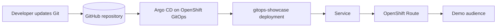

# OpenShift GitOps Demo Showcase

This repository now includes a polished sample application that is ready to be onboarded into Argo CD on OpenShift.

The goal is simple: when people open the demo, they should immediately see that your platform team can deliver a clean, production-minded, GitOps-driven deployment workflow.

## What is included

- A visually rich showcase web application
- OpenShift-native exposure using a `Route`
- Argo CD `AppProject` and `Application` manifests
- Kustomize base and production overlay
- Production-minded defaults such as:
	- health probes
	- resource requests and limits
	- pod disruption budget
	- horizontal pod autoscaler
	- non-root container settings

## Repository structure

```text
showcase/
├── apps/
│   └── gitops-showcase/
│       ├── base/
│       │   ├── configmap.yaml
│       │   ├── deployment.yaml
│       │   ├── hpa.yaml
│       │   ├── kustomization.yaml
│       │   ├── namespace.yaml
│       │   ├── pdb.yaml
│       │   ├── route.yaml
│       │   └── service.yaml
│       └── overlays/
│           └── prod/
│               ├── deployment-patch.yaml
│               └── kustomization.yaml
└── argocd/
		├── gitops-showcase-application.yaml
		├── gitops-showcase-project.yaml
		└── kustomization.yaml
```

## Demo architecture



## Application details

The sample application is a static site served by `nginxinc/nginx-unprivileged`.

Why this is a good demo choice:

- zero custom image build requirement for the first demo
- fast to deploy
- safe defaults for OpenShift
- easy to change live content through Git commits
- visually strong for presentations and stakeholder demos

## Step-by-step: onboard this app to Argo CD on OpenShift

### 1. Prerequisites

Make sure you have:

- access to an OpenShift cluster
- `oc` CLI installed and logged in
- OpenShift GitOps operator installed
- access to this Git repository from the cluster

Verify the GitOps namespace exists:

```bash
oc get ns openshift-gitops
```

Verify Argo CD is running:

```bash
oc get pods -n openshift-gitops
```

### 2. Push this repository to GitHub

Argo CD must be able to read the manifests from Git.

If you are using this repository as:

- a public repo: no extra repo credentials are required
- a private repo: add repository credentials in `openshift-gitops`

### 3. If the Git repository is private, register it in Argo CD

Create a repository secret in the `openshift-gitops` namespace.

Example using HTTPS and a GitHub personal access token:

```bash
oc apply -f - <<'EOF'
apiVersion: v1
kind: Secret
metadata:
	name: gitops-repo-credentials
	namespace: openshift-gitops
	labels:
		argocd.argoproj.io/secret-type: repository
stringData:
	type: git
	url: https://github.com/lostspy009/gitops.git
	username: <github-username>
	password: <github-token>
EOF
```

If the repo is public, skip this step.

### 4. Bootstrap the Argo CD objects

Apply the Argo CD project and application manifests:

```bash
oc apply -k showcase/argocd
```

This creates:

- `AppProject`: `gitops-showcase`
- `Application`: `gitops-showcase`

### 5. Confirm Argo CD has synced the application

Check the application object:

```bash
oc get application gitops-showcase -n openshift-gitops
```

Get more detail:

```bash
oc describe application gitops-showcase -n openshift-gitops
```

Wait for the namespace and workload:

```bash
oc get all -n gitops-showcase
```

### 6. Get the route and open the demo

Retrieve the application URL:

```bash
oc get route gitops-showcase -n gitops-showcase
```

Open the host shown in the output.

You should see a high-impact landing page that explains the GitOps flow and highlights OpenShift + Argo CD value.

### 7. Show the power of GitOps during the demo

For the live demo, change the page content in:

- `showcase/apps/gitops-showcase/base/configmap.yaml`

Then commit and push:

```bash
git add .
git commit -m "Update GitOps showcase content"
git push origin main
```

Argo CD will detect the new revision and reconcile the cluster automatically.

That gives you a strong demo story:

1. change in Git
2. Argo CD detects drift
3. OpenShift rolls out the update
4. users see the result through the Route

## Best demo flow for an audience

Use this sequence to make the presentation memorable:

### Phase 1: Show the repository

- walk through the `base` and `overlay` structure
- show the Argo CD `Application`
- explain that Git is the source of truth

### Phase 2: Show Argo CD

- open the Argo CD UI
- show the sync status
- show that the app targets the `gitops-showcase` namespace

### Phase 3: Show the running application

- open the OpenShift Route
- explain that the app is exposed natively on OpenShift
- point out that it is not just a plain pod demo, but a curated platform-ready deployment

### Phase 4: Make a live change

- update headline text or colors in `configmap.yaml`
- commit and push
- refresh Argo CD
- show the app update live

This is the moment that usually wins the room.

## Important files

- Application bootstrap: `showcase/argocd/gitops-showcase-application.yaml`
- Argo project definition: `showcase/argocd/gitops-showcase-project.yaml`
- Production overlay: `showcase/apps/gitops-showcase/overlays/prod/kustomization.yaml`
- Core app content: `showcase/apps/gitops-showcase/base/configmap.yaml`
- OpenShift Route: `showcase/apps/gitops-showcase/base/route.yaml`

## Customization ideas

To make the demo even more impressive, you can tailor:

- branding colors
- company logo
- platform team name
- environment badges
- live release notes section
- cluster facts or SRE metrics panel

## Notes

- The sample app uses a public container image for a fast start.
- The Route host is generated by OpenShift unless you explicitly set one.
- The `Application` uses automated sync, self-heal, and prune.
- The app is structured to be easy to extend into multi-environment GitOps later.

## Next-level enhancements

If you want to evolve this into an even richer platform demo later, add:

- separate `dev`, `stage`, and `prod` overlays
- image automation with Tekton or OpenShift Pipelines
- sealed secrets or external secrets
- policy enforcement with Kyverno or Gatekeeper
- progressive delivery with Argo Rollouts
- notifications on sync and health changes

---

This setup gives you a clean GitOps story, a strong OpenShift-native deployment, and a demo application that feels intentional rather than generic.
